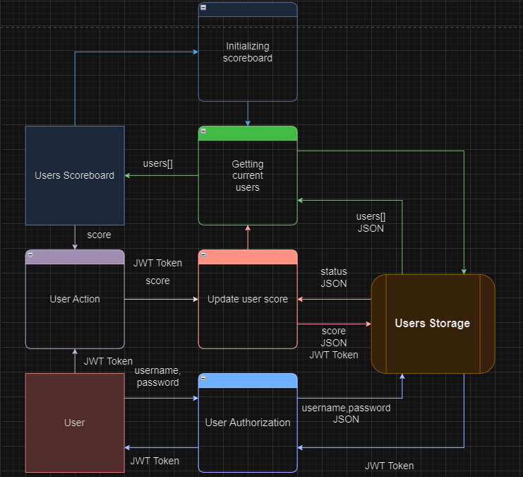

# Scoreboard API Module

This module is designed to handle live score updates for a scoreboard on a website. This document outlines the API endpoints, flow of execution, and security measures.

## API Endpoints

### Authentication - Get JWT Token

- **Endpoint:** ```/me```

- **Method:** ```POST```

- **Description:** Authenticates the user and returns a JWT token.

-  **Request:**
    - **Content-Type:** ```application/json```
    - **Body (example):**

     ```json
        {
          "username": "user123",
          "password": "password123"
        } 
    ```

- **Response:**

  - **Success:**
    - **HTTP Code:** ```200```
    - **Content-Type:** ```application/json```
    - **Body:**

      ```json
      {
        "token": "<JWT_TOKEN>"
      }
      ```

  - **Failure:**

    - **Invalid Credentials:**
      - **HTTP Code:** ```401```
      - **Content-Type:** ```application/json```
      - **Body:**

        ```json
        {
          "fail": {
            "message": "Invalid username or password"
          }
        }
        ```

    - **Other Errors:**
      - **HTTP Code:** ```500```
      - **Content-Type:** ```application/json```
      - **Body:**

        ```json
        {
          "fail": {
            "message": "Internal server error"
          }
        }
        ```
### Get - Top Users

- **Endpoint:** ```/users```

- **Method:** ```GET```

- **Query:** 
  - ```sort_by=desc(score)```: sort users by score
  - ```limit=10```: get first 10 users

- **Description:** Fetches the top 10 users with the highest scores.

- **Response:**

  - **Success:**
    - **HTTP Code:** ```200```
    - **Content-Type:** ```application/json```
    - **Body:** Array of users with length === limit - 1

      ```json
      [
        {
          "userId": 1,
          "score": 1000
        },
        {
          "userId": 20,
          "score": 678
        },
        {
          "userId": 100,
          "score": 567
        }
      ]
      ```

  - **Failure:**
    - **HTTP Code:** ```500```
    - **Content-Type:** ```application/json```
    - **Body:**

      ```json
        {
          "fail": {
            "message": "Internal server error"
          }
        }
      ```

### Update - User Score

- **Endpoint:** ```/user```

- **Method:** ```PATCH```

- **Description:** Updates the user's score after completing an action.

-  **Request:**
    - **Content-Type:** ```application/json```
    - **Headers:** ```Authorization: Bearer <JWT_TOKEN>```
    - **Body (example):**

     ```json
        {
          "score": 200
        }
    ```

- **Response:**

  - **Success:**
    - **HTTP Code:** ```200```
    - **Content-Type:** ```application/json```
    - **Body:**

      ```json
        {
          "success": {
            "message": "Score is successfully updated"
          }
        }
      ```

  - **Failure:**

    - **Unauthorized:**
      - **HTTP Code:** ```401```
      - **Content-Type:** ```application/json```
      - **Body:**

        ```json
        {
          "fail": {
            "message": "Access denied"
          }
        }
        ```

    - **Other Errors:**
      - **HTTP Code:** ```500```
      - **Content-Type:** ```application/json```
      - **Body:**

        ```json
        {
          "fail": {
            "message": "Internal server error"
          }
        }
        ```
### Live Updates - SSE

- **Endpoint:** ```/scores/stream```

- **Method:** ```GET```

- **Description:** Subscribe to real-time updates for the top 10 scores using Server-Sent Events.

- **Response:**

  - **Success:**
    - **HTTP Code:** ```200```
    - **Content-Type:** ```application/json```
    - **Headers:** ```Authorization: Bearer <JWT_TOKEN>```
    - **Body:**

      ```json
        {
          "data": [{"userId": 1, "score": 1000}, {"userId": 20, "score": 678}, {"userId": 100, "score": 567}]
        }
      ```

  - **Failure:**

    - **Unauthorized:**
      - **HTTP Code:** ```401```
      - **Content-Type:** ```application/json```
      - **Body:**

        ```json
        {
          "fail": {
            "message": "Access denied"
          }
        }
        ```

    - **Other Errors:**
      - **HTTP Code:** ```500```
      - **Content-Type:** ```application/json```
      - **Body:**

        ```json
        {
          "fail": {
            "message": "Internal server error"
          }
        }
        ```
## Additional Commenets & Improvements
- **JWT Token:** Implemented token to prevent unauthorized actions and potential secure issues.
- **Security Considerations:** Use HTTPS to ensure all communications, especially token exchange and sensitive data, are encrypted.
- **WebSocket Alternative:** WebSockets allow more interactive communication but require more server resources.

## Data Flow Diagram:

